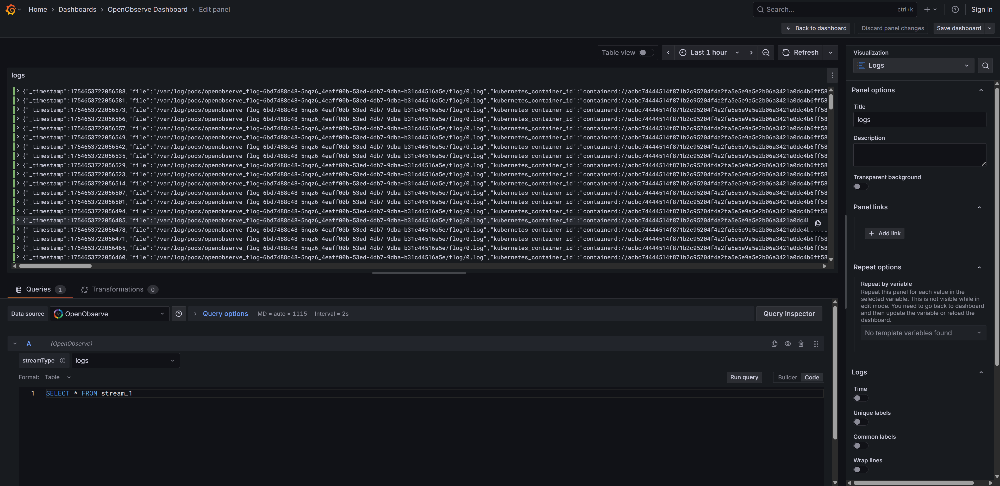
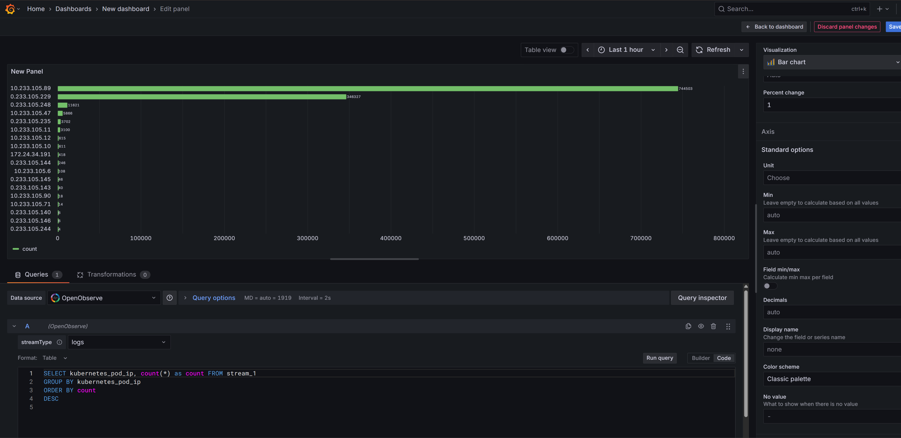
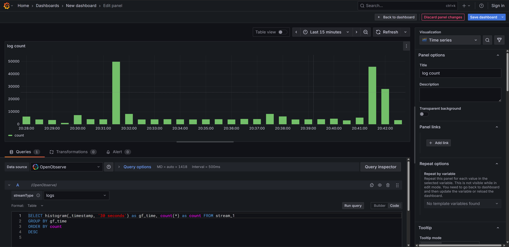
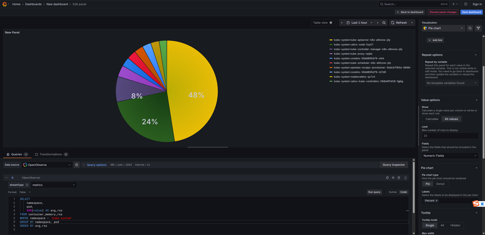
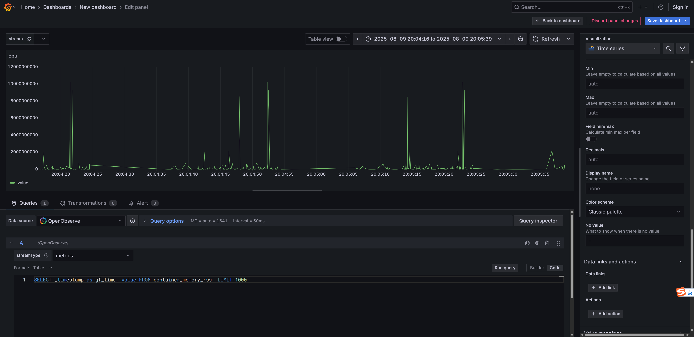
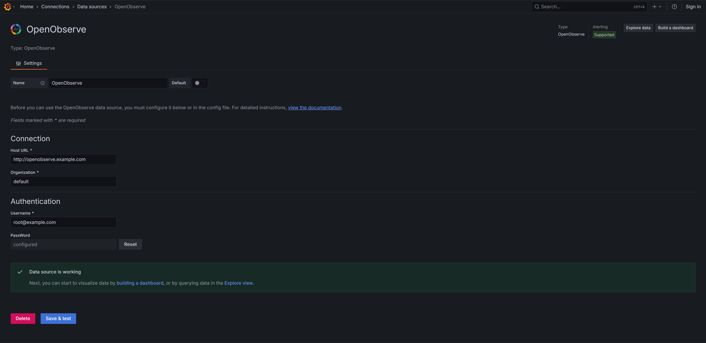
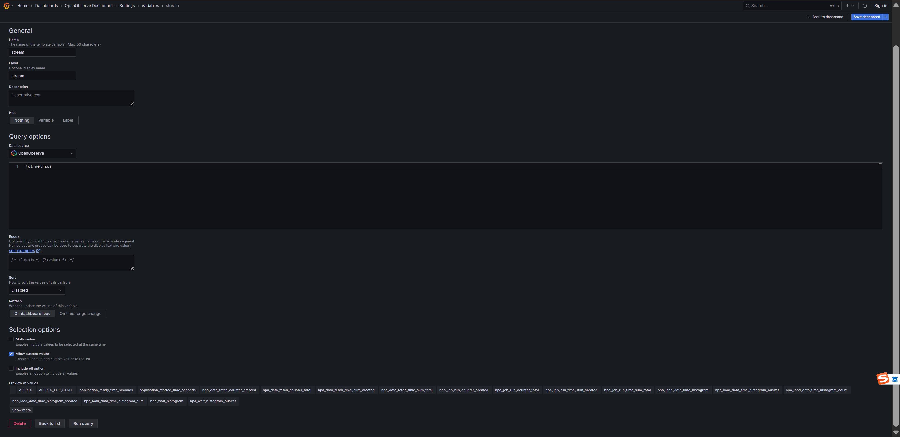

# 🔌Grafana OpenObserve Datasource Plugin 

<div align="center">

  
  
  
  
  
  
</div>

---

## 🛰️ Overview

The grafana_openobserve_datasource is a Grafana data source plugin that enables querying logs, metrics, and traces data from OpenObserve via Grafana. It supports SQL-based queries and allows for simple dashboard creation.

This plugin is non-official, the official one can be found [here](https://github.com/openobserve/openobserve-grafana-plugin).
But this one provides more features than the official one.


### 📸 Screenshots

#### Log search


#### Log Bar Chart


#### Log Count Histogram


#### Metrics Pie Chart


#### Metrics Time Series

 
### ✨ Key Features
- **Easy Configuration**: Simple setup datasource in Grafana
- **Multi-Type Stream Support**: Query logs, metrics, and traces from OpenObserve
- **SQL Query Interface**: SQL query support with syntax highlighting and auto-completion
- **Grafana Variables Support**: Ad-hoc filters and template variables support
- **SSE Streaming Search Support**: SSE mode streaming search 

### Notice
Since the Grafana and Openoberve timestamp format are different, so if you need to render some chart with time(shuch as TimeSeries), you need to convert the OpenObserve retrurned timestamp to Grafana time format. You can do it either by renaming the timestamp with AS keyword in SQL, or you can use grafna transform functions.


## 🚀 Installation

### Linux
1. Download the plugin from the [releases page](https://github.com/LinPr/grafana-openobserve-datasource/releases)
2. Extract to your Grafana plugins directory, add environment variable *GF_PLUGINS_ALLOW_LOADING_UNSIGNED_PLUGINS* allows you load non-offical grafana pluin 
   ```bash
   # Default plugin path is /var/lib/grafana/plugins/
   sudo unzip grafana-openobserve-datasource.zip -d /var/lib/grafana/plugins/
   export GF_PLUGINS_ALLOW_LOADING_UNSIGNED_PLUGINS=grafana-openobserve-datasource
   ```
3. Restart Grafana service


### Docker
1. Download the plugin from the [releases page](https://github.com/LinPr/grafana-openobserve-datasource/releases)
2. Extract to your local working directory
3. Start docker container with volume mount，add environment variable *GF_PLUGINS_ALLOW_LOADING_UNSIGNED_PLUGINS* allows you load non-offical grafana pluin 
   ```bash
   # Default plugin path is /var/lib/grafana/plugins/
   docker run --rm \
    -p 3000:3000 \
    --name=grafana \
    -e GF_PLUGINS_ALLOW_LOADING_UNSIGNED_PLUGINS=grafana-openobserve-datasource \
    -v  /root/grafana/plugins/grafana-openobserve-datasource:/var/lib/grafana/plugins/grafana-openobserve-datasource  \
    grafana/grafana
   ```

### Kubernete

1. Run grafana workload in kubernetes cluster with init container to inject the plugin, you can build a init container with the [docker/Dockerfile](docker/Dockerfile), you can set the *ARCH* variable as amd64 or arm64 for different CPU architecture, and you probably need to set *PROXY* if you are in China du to some reasons.
    ```bash
      export ARCH=amd64
      export PROXY=http://<host>:<port>
      docker build \
        --target=runtime \
        --build-arg ARCH=${ARCH} \
        --build-arg PROXY=${PROXY} \
        -t grafana-openobserve-datasource:latest-${ARCH} \
        -f docker/Dockerfile \
        .
    ```

2. Set the environment variable GF_PLUGINS_ALLOW_LOADING_UNSIGNED_PLUGINS to allow non-officia plugin to be loaded when grafana init (The following example grafana deploy manifest is not completed, you need to complete it your self depending on your deploy environment).
   ```yaml

      initContainers:
      - command:
        - sh
        - -c
        - rm -rf ${GF_PATHS_PLUGINS}/grafana-openobserve-datasource && mkdir -p ${GF_PATHS_PLUGINS}
          && cp -r grafana-openobserve-plugin ${GF_PATHS_PLUGINS}/grafana-openobserve-datasource
        env:
        - name: GF_PATHS_PLUGINS
          value: /var/lib/grafana/plugins
        image: your-registry/grafana-openobserve-datasource
        .....

      containers:
      - env:
        - name: GF_AUTH_LDAP_ENABLED
          value: "true"
        - name: GF_PLUGINS_ALLOW_LOADING_UNSIGNED_PLUGINS
          value: grafana-openobserve-datasource
        image: grafana/grafana:12.0.2
        imagePullPolicy: IfNotPresent
        name: grafana
        ......
   ```  

### Build locally
 
1. Build backend:
    ```bash
    mage build:linux
    ```
2. Build frontend
   ```bash
   npm run build
   ```
3. Package
   ```bash
   cp -r dist openobserve-grafana-plugin
   zip openobserve-grafana-plugin.zip openobserve-grafana-plugin
   ```


## 🔍 Usage
### Configuration


### Explore
#### query
you can use sql code editor mode or builder mode to search for logs, metrics, and traces, but I recommand to use code editor mod for more flexibility. And you can take advantage of editor IntelliSense, press *ctrl+i(for windows user)* to .


#### variables
You can use grafana variables and ad-hoc filters to filter result  that you care about.in Grafana Dashboard




  

## 🛠️ Development

Before starting to develop the plugin, make sure you have:
-  **Node.js**: Frontend, version 22 or higher
-  **Go**: Backend, version 1.24.6 or higher
-  **OpenObserve**: Datasource, Versuion 0.14.7 or higher
-  **Docker**：Run docker compose and starting a Grafana container instance with grafana_openobserve_datasource plugin inside for developing environment

More details, please refer to [Development Documentation](doc/develop.md) 📖


### Reporting Issues
- Use the [GitHub Issues](https://github.com/LinPr/grafana-openobserve-datasource/issues) page
- Provide detailed reproduction steps
- Include relevant logs and screenshots

### Feature Requests
- Check existing issues first
- Describe your use case clearly  
- Explain the expected behavior

 
### Contributing 

If you have any good ideas, feel free to reach me out, you can also create pull requests for some new featurse or code enhancements to this project! 


## 🙏Acknowledgment
- Thanks to [Grafana](https://github.com/grafana/grafana) maintainers for suggesting me to use grafana-ui library (from GitHub issue) to build the pretty SQL query editor frontend of this plugin.
- Thanks to [OpenObserve](https://github.com/openobserve/openobserve) maintainers for their help about opennobserve search API usage and resolve many other meticulous technical supports.
- Thanks to [jiandaoyun](https://github.com/jiandaoyun) team for supporting and giving some suggestions and feedbacks to imporve the plugin functions.

## 📄 License

This project is licensed under the **Apache License 2.0** - see the [LICENSE](LICENSE) file for details. 

---

<div align="center">
  <h3> If this helps you, please give it a ⭐</h3>
</div>

